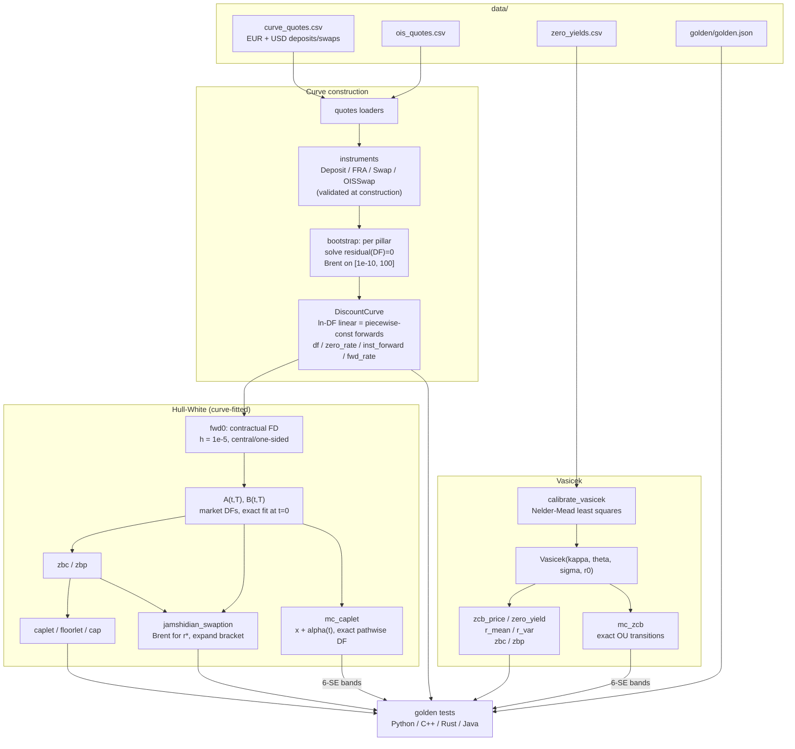
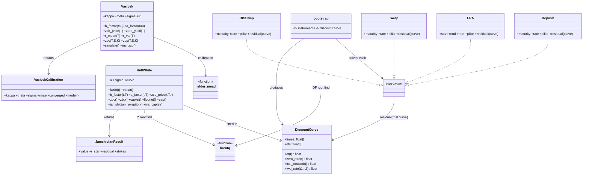
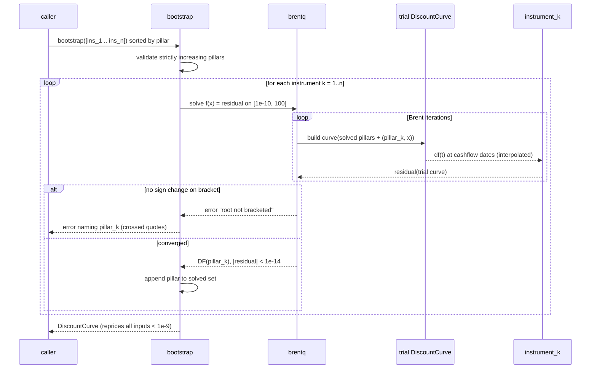

# ARCHITECTURE — irm

Design notes for the `irm` project: component responsibilities, data
flow, numerical decisions and their trade-offs, error handling per
language, testing strategy, and performance characteristics. The
language-neutral behavioral contract lives in [../API_SPEC.md](../API_SPEC.md);
this document explains *why* the contract looks the way it does.

## 1. Component map

Seven components with one-way dependencies (no cycles; kernels at the
bottom, models at the top):

| Component (py module) | Responsibility | Depends on |
|---|---|---|
| `curve` | `DiscountCurve`: ln-DF interpolation, zero/forward queries, `par_swap_rate` | — |
| `rootfind` | Native Brent (`brentq`) + bisection fallback | — |
| `optimize` | Native Nelder-Mead simplex, `NelderMeadResult` | — |
| `mathutils` | `norm_cdf` (erfc-based), exact OU step moments | — |
| `bootstrap` | Instrument types (`Deposit`, `FRA`, `Swap`, `OISSwap`) with residuals; sequential `bootstrap` | curve, rootfind |
| `vasicek` | `Vasicek` closed forms, ZCB options, exact-transition MC, `calibrate_vasicek` | mathutils, optimize |
| `hullwhite` | `HullWhite` fitted to a curve: FD forwards, affine ZCB, caplets/caps, Jamshidian swaption, MC | curve, rootfind, mathutils |
| `quotes` | CSV loaders for the bundled data | bootstrap |

Every port mirrors this decomposition (C++ headers `include/irm/*.hpp`,
Rust modules re-exported from `lib.rs`, Java classes in
`com.quant.irm`). The kernels — Brent, Nelder-Mead, `erfc`-CDF, OU
moments — are **implemented natively in each language**; no port may
call scipy/Boost/Commons-Math equivalents, because the golden values pin
behavior the contract defines (bracket policy, convergence tests,
simplex coefficients), not whatever a library happens to do.

## 2. Data flow

Key structural facts:

* The **curve is the only shared state**. `HullWhite` holds a reference
  to an immutable `DiscountCurve`; nothing mutates a curve after
  construction (Python enforces this with `__slots__` + tuples; C++ by
  value semantics + const methods; Rust by ownership; Java by defensive
  copies of the input arrays).
* **Vasicek is curve-free** (its curve is implied by its parameters);
  Hull-White is curve-parametric. This is the textbook distinction —
  equilibrium vs no-arbitrage — expressed as a dependency arrow.
* MC engines reuse one kernel: the exact OU step moments in
  `mathutils`. Both models simulate the *pair* `(x, ∫x dt)` from its
  exact bivariate Gaussian; neither has an Euler loop anywhere.

## 3. Class relationships

`Instrument` is a Python `Union` / C++ `std::variant` / Rust `enum` /
Java sealed-style interface — a closed set by design: the bootstrap's
correctness argument (each pillar introduces exactly one unknown solved
against earlier pillars) is per-instrument-type, so extension is a
deliberate act, not an open plugin point.

## 4. The bootstrap loop in detail

Rebuilding a small trial curve per function evaluation is O(pillars) and
deliberately simple — see the performance section for why this is the
right trade.

## 5. Numerical design decisions and trade-offs

1. **Interpolate ln DF linearly (piecewise-constant forwards).** Chosen
   for locality (quote deltas stay in their bucket — verified in
   LEARN.md §6), guaranteed positivity of DF, exactness at pillars, and
   O(log n) queries. Cost: discontinuous instantaneous forwards, which
   surfaces in `theta(t)` spikes at pillars (documented, harmless — see
   decision 3). Alternatives (splines, monotone convex) were rejected
   because non-local risk and possible oscillation are worse failure
   modes for a teaching/reference implementation than an ugly forward
   step.
2. **Contractual finite differences.** `f^M(0,t)` is *defined* as a
   specific stencil (`h = 1e-5`, central for `t >= h`, one-sided below),
   and `theta(t)`'s `df/dt` as a forward difference with `h' = 1e-4`.
   Analytically the curve's forwards are piecewise constant and could be
   read off exactly, but then golden values would depend on each port's
   segment-lookup edge decisions at pillars. A fixed stencil makes the
   quantity reproducible to ~1e-12 in any language for tolerances far
   tighter than the FD error matters. Trade-off: the FD *averages* the
   two adjacent forwards when the stencil straddles a pillar — accepted
   and documented; at `t = 0` the affine `A` cancels the forward term
   algebraically so no FD error enters t=0 prices at all.
3. **Absorb `theta(t)` into `A(t,T)` via market DFs.** Pricing never
   integrates `theta`; the fit is exact by construction
   (`hw_zcb_t0` tol 1e-12). The explicit `theta(t)` function exists only
   for inspection/tests. This dodges the whole question of integrating a
   distributionally-spiky drift (piecewise-constant forwards make
   `df/dt` a sum of delta functions) — the standard production trick.
4. **Exact-transition Monte Carlo, jointly with the integral.** Both MC
   engines sample `(x', ∫x dt)` from the exact bivariate Gaussian
   (conditional decomposition, two normals per step in a fixed order).
   No discretization bias at any step count, so golden MC cases can be
   statistical (6-SE bands) rather than seed-pinned — which is what
   makes them portable across RNGs and languages. Trade-off: exact
   moments exist only because the models are OU; this pattern does not
   generalize to CIR or non-affine models.
5. **Wide, meaningful root brackets.** Bootstrap: `DF ∈ [1e-10, 100]` —
   wide enough for deeply negative rates (DF up to 100 ≈ −46%/y over
   10y), and a bracketing failure is *exactly* the no-arbitrage
   violation, so the error message can say "crossed quotes" instead of
   "solver failed". Jamshidian: expanding bracket from `[-1, 1]`
   (doubling the failing side, ≤ 24 times) exploits strict monotonicity
   of the coupon bond in `r`; residual `< 1e-10` is asserted on the
   result so a silent bad root cannot propagate into strikes.
6. **Penalty-based domain handling in calibration.** Nelder-Mead is
   unconstrained; hard-throwing inside the objective would kill the
   simplex. Out-of-domain points get a finite penalty
   `1e6 (1 + distance)` sloping back toward the feasible region;
   `sigma` is returned as `|sigma|` (the objective is even in it);
   non-convergence sets `converged=False` — reported, never raised, per
   the shared conventions.
7. **`erfc`-based normal CDF.** `N(x) = erfc(-x/√2)/2` preserves
   relative accuracy in the tails where `1 - erf` cancels; ports without
   a standard-library `erfc` implement one to ≥ 1e-12 absolute. Matters
   for far-OTM ZCB options whose value *is* a tail probability.
8. **Times as year fractions, ACT/365F, no date library.** All schedule
   logic (annual fixed legs with short first stubs) is arithmetic on
   floats with an epsilon guard (`ceil(T - 1e-12)`). This keeps all four
   ports free of calendar dependencies; the README/LEARN document
   exactly which desk conventions (ACT/360, IMM dates, business-day
   rolls) are out of scope.

## 6. Error-handling strategy

Uniform rule: **invalid input fails fast with a descriptive message;
numerical non-convergence of a *calibration* is reported in-band;
non-convergence of a *root find* is an error** (it means the inputs, not
the algorithm, are bad — crossed quotes, degenerate coupon bond).

| Situation | Python | C++ | Rust | Java |
|---|---|---|---|---|
| Bad construction args (times, DFs, params) | `ValueError` | `std::invalid_argument` | `Err(IrmError::InvalidInput)` | `IllegalArgumentException` |
| No admissible root (crossed quotes, bracket) | `ValueError` (names pillar) | `std::domain_error` | `Err(IrmError::Bracket)` | `IllegalArgumentException` |
| Calibration didn't converge | `converged=False` on result | same | same | same |
| NaN/inf anywhere in inputs | rejected at the boundary | same | same | same |

Design points: validation lives at *construction* (instruments check
`1 + R·τ > 0` when built, so a bad quote is caught before any solving
starts), messages carry the offending value and pillar, and Rust is the
one port with a typed error enum — its variants map 1:1 onto the two
exception categories the other languages use, so tests can assert error
*kind* everywhere.

## 7. Testing strategy

Four layers, mirrored in every language (Python: 96 pytest cases;
`aim ≥ 25 meaningful assertions` per port from the conventions):

1. **Golden values** (`data/golden/golden.json`, ~25 cases): flat JSON,
   absolute tolerances. Deterministic cases (curve math, closed forms)
   at 1e-8..1e-14; the two MC cases at 6-SE bands measured at 50k paths
   so any unbiased scheme with any RNG passes, and any biased scheme
   fails. Cases that need a curve rebuild it from `t{i}/df{i}` inputs or
   re-bootstrap from the CSVs — so the goldens also pin the loaders and
   the bootstrap end-to-end.
2. **Round-trip / consistency properties**: bootstrapped curves reprice
   every input `< 1e-9`; interpolation exact at pillars; `F(t1,t2)`
   consistent with DF ratios; ZCB put-call parity across strike grids;
   caplet-floorlet parity vs the swaplet; cap equals its caplet sum;
   swaption ≥ intrinsic; Jamshidian `|g(r*)| < 1e-10`; Vasicek MC within
   3 SE of analytic; HW MC caplet within 3 SE; `sigma = 0`
   degenerations (intrinsic caplet, zero-SE MC).
3. **Edge/validation tests**: duplicate and non-monotone pillars,
   `DF <= 0`, `t < 0`, NaN/inf, crossed quotes at construction and at
   solve time, `DF > 1` *supported* (asserted, not just tolerated),
   inverted/steep/flat curve fixtures, deposit-only and swap-only
   curves with interpolated gaps.
4. **Kernel cross-checks** (Python only): native Brent/Nelder-Mead/CDF
   vs scipy — scipy appears in `requirements.txt` for tests only and is
   never imported by the package.

The generator (`data/generate_data.py`) re-validates before overwriting
data: repricing < 1e-9, closed forms vs 200k-path MC within 3 SE, HW fit
at 1e-12 — so a regenerated dataset cannot silently disagree with the
codebase that produced it.

## 8. Performance notes

* **Bootstrap** rebuilds a trial curve per residual evaluation:
  O(pillars) per evaluation, ~10-40 Brent iterations per pillar, 14
  pillars per bundled curve — microseconds to low milliseconds
  end-to-end in every language. Quadratic-in-pillars overall, which is
  irrelevant at real curve sizes (≤ ~60 pillars); the simplicity buys an
  obviously-correct trial-curve semantics (intermediate dates always
  interpolate on the current partial curve).
* **Curve queries** are a binary search plus one exp: O(log n). The
  Python implementation caches `ln DF` at nodes; ports do the same.
* **Closed forms** (ZCB, options, swaption strikes) are a handful of
  exp/erfc calls — nanosecond-scale; the Jamshidian root find costs
  ~10-15 coupon-bond evaluations.
* **Monte Carlo** dominates runtime. Python vectorizes across paths with
  numpy (two `standard_normal(n_paths)` draws per step); compiled ports
  loop natively. Because transitions are exact, step counts stay tiny
  (demo/tests use 8 steps where a Euler scheme would need hundreds for
  comparable bias) — that, not language speed, is the big win. 50k paths
  x 8 steps runs well under a second everywhere, keeping each language's
  test suite under the conventions' 60s budget (Python: ~1.3s total).
* **Determinism**: seeds fix each language's own stream; cross-language
  agreement is statistical by design (see testing). No global RNG state
  — every MC call takes an explicit seed, so tests parallelize safely.
