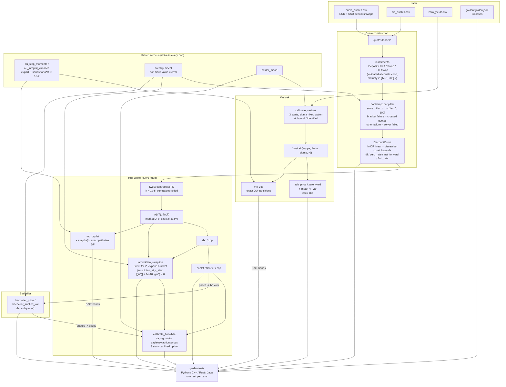
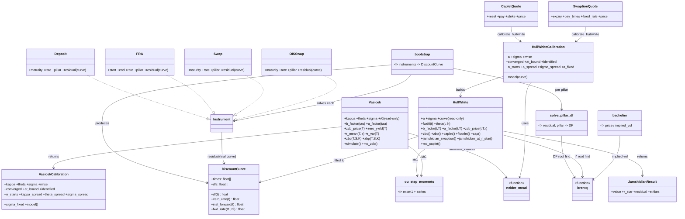
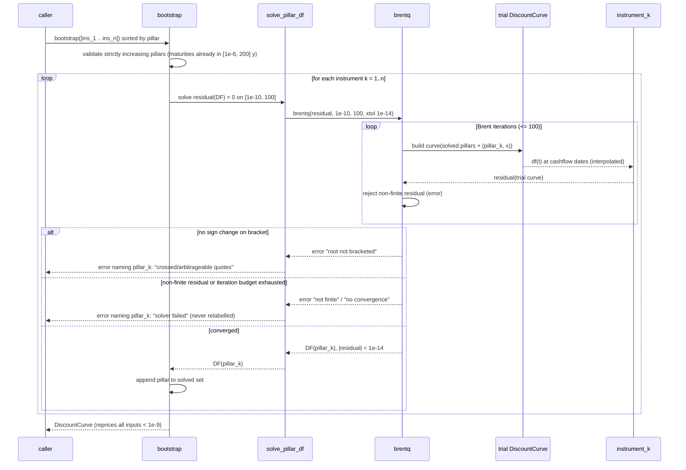

# ARCHITECTURE — irm

Design notes for the `irm` project: component responsibilities, data
flow, numerical decisions and their trade-offs, error handling per
language, testing strategy, and performance characteristics. The
language-neutral behavioral contract lives in [../API_SPEC.md](../API_SPEC.md);
this document explains *why* the contract looks the way it does.

## 1. Component map

Nine components with one-way dependencies (no cycles; kernels at the
bottom, models at the top):

| Component (py module) | Responsibility | Depends on |
|---|---|---|
| `curve` | `DiscountCurve`: ln-DF interpolation, zero/forward queries, `par_swap_rate` | — |
| `rootfind` | Native Brent (`brentq`) + bisection fallback; non-finite values and non-convergence are errors | — |
| `optimize` | Native Nelder-Mead simplex, `NelderMeadResult` | — |
| `mathutils` | `norm_cdf`/`norm_pdf` (erfc-based), exact OU step moments, cancellation-free `ou_integral_variance` | — |
| `bachelier` | Normal-model price and implied vol | mathutils, rootfind |
| `bootstrap` | Instrument types (`Deposit`, `FRA`, `Swap`, `OISSwap`) with residuals and maturity bounds; `solve_pillar_df`; sequential `bootstrap` | curve, rootfind |
| `vasicek` | `Vasicek` closed forms, ZCB options, exact-transition MC, multi-start `calibrate_vasicek` | mathutils, optimize |
| `hullwhite` | `HullWhite` fitted to a curve: FD forwards, affine ZCB, caplets/caps, Jamshidian swaption (+ `jamshidian_at_r_star`), MC, `calibrate_hullwhite` | curve, rootfind, mathutils, optimize |
| `quotes` | CSV loaders for the bundled data (locale-independent parsing in C++) | bootstrap |

Every port mirrors this decomposition (C++ headers `include/irm/*.hpp`,
Rust modules re-exported from `lib.rs`, Java classes in
`com.quant.irm`). The kernels — Brent, Nelder-Mead, `erfc`-CDF, OU
moments — are **implemented natively in each language**; no port may
call scipy/Boost/Commons-Math equivalents, because the golden values pin
behavior the contract defines (bracket policy, convergence tests,
simplex coefficients), not whatever a library happens to do.

## 2. Data flow

Key structural facts:

* The **curve is the only shared state**. `HullWhite` holds a reference
  to an immutable `DiscountCurve`; nothing mutates a curve after
  construction (Python enforces this with `__slots__` + tuples; C++ by
  value semantics + const methods; Rust by ownership; Java by defensive
  copies of the input arrays). Model parameters are likewise read-only in
  every port (Python `__slots__` + properties, C++/Java private final
  fields, Rust private fields), so a validated model cannot be put into an
  invalid state afterwards.
* **Vasicek is curve-free** (its curve is implied by its parameters);
  Hull-White is curve-parametric. This is the textbook distinction —
  equilibrium vs no-arbitrage — expressed as a dependency arrow.
* MC engines reuse one kernel: the exact OU step moments in
  `mathutils`. Both models simulate the *pair* `(x, ∫x dt)` from its
  exact bivariate Gaussian; neither has an Euler loop anywhere. The
  Hull-White pathwise discount factor `V(t)` is the same kernel
  (`ou_integral_variance / 2`), so the small-`a·dt` fix lives in one place.
* Both calibrations share the Nelder-Mead kernel and the same diagnostic
  vocabulary (`converged`, `at_bound`, `n_starts`, spreads, `identified`),
  and `bachelier` is the bridge between model prices and market bp vols.

## 3. Class relationships

`Instrument` is a Python `Union` / C++ `std::variant` / Rust `enum` /
Java sealed-style interface — a closed set by design: the bootstrap's
correctness argument (each pillar introduces exactly one unknown solved
against earlier pillars) is per-instrument-type, so extension is a
deliberate act, not an open plugin point.

## 4. The bootstrap loop in detail

Rebuilding a small trial curve per function evaluation is O(pillars) and
deliberately simple — see the performance section for why this is the
right trade. `solve_pillar_df` is public so the two error classes
(bracketing failure = crossed quotes; anything else = solver failure) can
be tested with an injected residual in every language.

## 5. Numerical design decisions and trade-offs

1. **Interpolate ln DF linearly (piecewise-constant forwards).** Chosen
   for locality (quote deltas stay in their bucket — verified in
   LEARN.md §6), guaranteed positivity of DF, exactness at pillars, and
   O(log n) queries. Cost: discontinuous instantaneous forwards, which
   surfaces in `theta(t)` spikes at pillars (documented, harmless — see
   decision 3). Alternatives (splines, monotone convex) were rejected
   because non-local risk and possible oscillation are worse failure
   modes for a teaching/reference implementation than an ugly forward
   step.
2. **Contractual finite differences.** `f^M(0,t)` is *defined* as a
   specific stencil (`h = 1e-5`, central for `t >= h`, one-sided below),
   and `theta(t)`'s `df/dt` as a forward difference with `h' = 1e-4`.
   Analytically the curve's forwards are piecewise constant and could be
   read off exactly, but then the stencil-dependent outputs would depend
   on each port's segment-lookup edge decisions at pillars. A fixed
   stencil makes them reproducible to ~1e-12 in any language. Which
   outputs are those: `P(t>0,T;r)` with an explicit `r`, the reported
   `r*`, the decomposition strikes and `theta(t)` — pinned by the goldens
   `hw_zcb_t1_explicit_r` and `hw_swaption_payer.r_star/strike_i`. Every
   pinned *price* is stencil-independent (closed forms use market DFs; in
   the swaption the strikes and `r*` shift together). Trade-off: the FD
   *averages* the two adjacent forwards when the stencil straddles a
   pillar — accepted and documented; at `t = 0` the affine `A` cancels
   the forward term algebraically so no FD error enters t=0 prices at all.
3. **Absorb `theta(t)` into `A(t,T)` via market DFs.** Pricing never
   integrates `theta`; the fit is exact by construction
   (`hw_zcb_t0` tol 1e-12). The explicit `theta(t)` function exists only
   for inspection/tests. This dodges the whole question of integrating a
   distributionally-spiky drift (piecewise-constant forwards make
   `df/dt` a sum of delta functions) — the standard production trick.
4. **Exact-transition Monte Carlo, jointly with the integral.** Both MC
   engines sample `(x', ∫x dt)` from the exact bivariate Gaussian
   (conditional decomposition, two normals per step in a fixed order).
   No discretization bias at any step count, so golden MC cases can be
   statistical (6-SE bands) rather than seed-pinned — which is what
   makes them portable across RNGs and languages. Trade-off: exact
   moments exist only because the models are OU; this pattern does not
   generalize to CIR or non-affine models.
5. **Wide, meaningful root brackets — and honest failure classes.**
   Bootstrap: `DF ∈ [1e-10, 100]` — wide enough for deeply negative rates
   (DF up to 100 ≈ −46%/y over 10y), and a *bracketing* failure is
   *exactly* the no-arbitrage violation, so that error says "crossed
   quotes"; any other solver failure (a NaN residual, an exhausted
   budget) says "solver failed" instead of being relabelled. The root
   finders reject non-finite function values outright (a NaN used to be
   returned as a "root"). Jamshidian: expanding bracket from `[-1, 1]`
   (doubling the failing side, ≤ 24 times, never past the `exp()`
   overflow point) exploits the single crossing of the coupon bond
   through par — strictly decreasing for `X ≥ 0`, single-minimum with one
   crossing for `X < 0` with `1 + Xτ_n > 0` (an exponential sum whose
   coefficients change sign once), degenerate otherwise. The contract
   `|g(r*)| < 1e-10` and `g'(r*) < 0` is enforced in every port through
   the public `jamshidian_at_r_star`, so a bad root cannot propagate into
   strikes and inputs beyond double precision (≈ `X < -0.9`) are
   rejected rather than priced.
6. **Penalty-based domain handling in calibration, plus multi-start
   diagnostics.** Nelder-Mead is unconstrained; hard-throwing inside the
   objective would kill the simplex. Out-of-domain points get a finite
   penalty `1e6 (1 + distance)` sloping back toward the feasible region;
   `sigma` is returned as `|sigma|` (the objective is even in it). But a
   simplex that walks into the penalty wall stops *there* and reports
   convergence, and yields identify Vasicek's three parameters weakly
   (two minima within 2 % rmse on the bundled data). So both calibrations
   run three fixed starts, flag `at_bound` (and force `converged=False`
   there), report the parameter spread across equally-good starts and an
   `identified` verdict, and offer `sigma_fixed` / `a_fixed` for the
   practitioner workflow. Non-convergence is still reported, never raised.
7. **`erfc`-based normal CDF.** `N(x) = erfc(-x/√2)/2` preserves
   relative accuracy in the tails where `1 - erf` cancels; ports without
   a standard-library `erfc` implement one to ≥ 1e-12 absolute. Matters
   for far-OTM ZCB options whose value *is* a tail probability.
8. **Times as year fractions, ACT/365F, no date library.** All schedule
   logic (annual fixed legs with short first stubs) is arithmetic on
   floats with an epsilon guard (`ceil(T - 1e-12)`) and a hard maturity
   range `[1e-6, 200]` years, so the schedule length is bounded (a
   maturity typed in days used to be UB in C++, a panic in Rust and a
   16 GB allocation in Java). This keeps all four ports free of calendar
   dependencies; the README/LEARN document exactly which desk conventions
   (ACT/360, IMM dates, business-day rolls) are out of scope.
9. **`expm1` everywhere, and a series where `expm1` is not enough.** Every
   `1 - e^{-x}` is `-expm1(-x)`. The integrated-OU variance cancels three
   O(dt) terms to O(a²dt³), which even the `expm1` form cannot save below
   `a·dt ≈ 1e-2` (relative error ∝ ε/x²): a six-term power series takes
   over there, giving < 3e-15 below the threshold and < ~1e-11 above it.
   The plain formula was 80× wrong at `a·dt = 1e-7`, and the `max(·, 0)`
   guard hid it.
10. **Overflow is an error, not `inf`.** `exp(-B r)` for an absurd `r`,
    `DF(t1)/DF(t2)` when `DF(t2)` underflowed — every place a double can
    silently leave the finite range checks and raises the standard error,
    so NaN/inf never enter a book-level sum.

## 6. Error-handling strategy

Uniform rule: **invalid input fails fast with a descriptive message;
numerical non-convergence of a *calibration* is reported in-band;
non-convergence of a *root find* is an error** (it means the inputs, not
the algorithm, are bad — crossed quotes, degenerate coupon bond).

| Situation | Python | C++ | Rust | Java |
|---|---|---|---|---|
| Bad construction args (times, DFs, params, NaN/inf, maturity range, wrong-length `x0`) | `ValueError` | `std::invalid_argument` | `Err(IrmError::InvalidInput)` | `IllegalArgumentException` |
| Bootstrap: no admissible DF (crossed quotes) | `ValueError` "crossed" (names pillar) | `std::domain_error` | `Err(IrmError::Bootstrap)` | `IllegalArgumentException` |
| Bootstrap: any other solver failure | `ValueError` "solver failed" (names pillar) | `std::domain_error` | `Err(IrmError::Bootstrap)` | `IllegalArgumentException` |
| Root finder: unbracketed, non-finite value, no convergence | `ValueError` | `std::invalid_argument` (bracket) / `std::domain_error` (numerical) | `Err(IrmError::RootFind)` | `IllegalArgumentException` |
| Jamshidian: degenerate coupons (`1 + Xτ_n ≤ 0`) | `ValueError` | `std::invalid_argument` | `Err(IrmError::InvalidInput)` | `IllegalArgumentException` |
| Jamshidian: cannot bracket / `|g(r*)| ≥ 1e-10` / `g'(r*) ≥ 0` | `ValueError` | `std::domain_error` | `Err(IrmError::RootFind)` | `IllegalArgumentException` |
| Result not representable (exp overflow, DF underflow) | `ValueError` | `std::invalid_argument` | `Err(IrmError::InvalidInput)` | `IllegalArgumentException` |
| Data file unreadable / malformed | `ValueError` / `OSError` | `std::invalid_argument` | `Err(IrmError::Data)` | `IllegalArgumentException` / `UncheckedIOException` |
| Calibration didn't converge or sits on a bound | `converged=False` (+ `at_bound`) on result | same | same | same |
| Calibration not identified | `identified=False` on result | same | same | same |

Design points: validation lives at *construction* (instruments check
`1 + R·τ > 0` and the maturity range when built, so a bad quote is caught
before any solving starts), messages carry the offending value and
pillar, no function ever returns NaN/inf, and Rust is the one port with a
typed error enum: `InvalidInput`, `RootFind`, `Bootstrap`, `Data`, which
the table maps onto the exception classes of the other languages so tests
can assert error *kind* everywhere. Java uses `IllegalArgumentException`
uniformly (the residual contract used to throw `IllegalStateException`;
it no longer does).

## 7. Testing strategy

Five layers, mirrored in every language — Python 220 pytest cases, C++
130 GoogleTest cases, Rust 102 (17 unit + 85 integration), Java 162 JUnit
cases, 614 in total:

1. **Golden values** (`data/golden/golden.json`, exactly 33 cases): flat
   JSON, absolute tolerances, one or more expected outputs per case, one
   test per case (`INSTANTIATE_TEST_SUITE_P` in C++, `Parameterized` in
   Java, `pytest.mark.parametrize`, a collect-all loop in Rust) so one
   bad case cannot mask another. Deterministic cases (curve math, closed
   forms, Bachelier, the calibrations) at 1e-6..1e-14; the two MC cases at
   6-SE bands measured at 50k paths so any unbiased scheme with any RNG
   passes, and any biased scheme fails. Cases that need a curve rebuild it
   from `t{i}/df{i}` inputs or re-bootstrap from the CSVs — so the goldens
   also pin the loaders and the bootstrap end-to-end; `r_star`, the
   decomposition strikes and `P(t>0,T;r)` are pinned so the FD stencil is
   really contractual.
2. **Independent references**: the integrated-OU variance against 60-digit
   `decimal` arithmetic (the pinned numbers in the C++/Rust/Java tests
   come from that computation); the Jamshidian value against direct
   Simpson integration of the payoff under the `T`-forward Gaussian law,
   for positive *and* negative fixed rates; Brent/Nelder-Mead/CDF against
   scipy (Python only).
3. **Round-trip / consistency properties**: bootstrapped curves reprice
   every input `< 1e-9`; DV01 localises in quote space (bump the 5y
   quote, the 10y par rate does not move; bump the 10y quote, it moves by
   exactly 1 bp); interpolation exact at pillars; `F(t1,t2)` consistent
   with DF ratios; ZCB put-call parity across strike grids;
   caplet-floorlet parity vs the swaplet; cap equals its caplet sum;
   swaption ≥ intrinsic and payer − receiver = forward swap; `|g(r*)| <
   1e-10`; Bachelier price/vol round trips and payer-receiver parity;
   Vasicek MC within 3 SE (including 2000 steps at `κ = 1e-3`); HW MC
   caplet within 3 SE (including `a = 1e-4`); same seed → identical
   results; `sigma = 0` and single-path degenerations (SE exactly 0).
4. **Edge/validation tests**: duplicate and non-monotone pillars,
   `DF ≤ 0`, `t < 0`, NaN/inf in every public argument (notional, strike,
   schedule, `x0`, quotes), maturities of `1e12` and `1e-13`, crossed
   quotes at construction and at solve time vs. solver failures (injected
   NaN residual through `solve_pillar_df` / a duck-typed instrument),
   non-convergent root finds, exp overflow, DF underflow, `DF > 1`
   *supported*, inverted/steep/flat curve fixtures, calibration from a
   penalty start (`at_bound`, not converged), flat yields (`sigma` on its
   bound), multi-start non-identifiability, `sigma_fixed` / `a_fixed`,
   single-quote HW ridge.
5. **Documentation**: `tools/check_cookbook_snippets.py` extracts every
   Python/C++/Rust/Java block from COOKBOOK.md and compiles/runs it against
   the built libraries (Java with `-Xlint:all -Werror`).

The generator (`data/generate_data.py`) re-validates before overwriting
data: repricing < 1e-9, closed forms vs 200k-path MC within 3 SE, HW fit
at 1e-12, Bachelier round trip at 1e-12, HW calibration recovery at 1e-9
— so a regenerated dataset cannot silently disagree with the codebase
that produced it (and it writes LF line endings so the CSVs are
byte-stable).

## 8. Performance notes

Measured on the shared 2-core build box (single thread; Python 3.11 +
numpy, g++ 13 `-O2`); expect ±30 % elsewhere.

| Operation | Python reference | C++ port |
|---|---|---|
| Bootstrap the 14-instrument USD curve | 0.78 ms | 29 µs |
| Jamshidian 1y-into-5y swaption | 0.33 ms | 8 µs |
| `mc_zcb`, 50k paths × 8 steps | 30 ms | 16 ms |
| `mc_caplet`, 50k paths × 8 steps | 19 ms | 16 ms |
| `calibrate_vasicek`, 3 starts, 10 yields | 17 ms | 1.0 ms |
| `calibrate_hullwhite`, 3 caplets, 3 starts | 5 ms | — |

* **Bootstrap** rebuilds a trial curve per residual evaluation:
  O(pillars) per evaluation, ~10-40 Brent iterations per pillar.
  Quadratic-in-pillars overall, which is irrelevant at real curve sizes
  (≤ ~60 pillars); the simplicity buys an obviously-correct trial-curve
  semantics (intermediate dates always interpolate on the current partial
  curve). A full keyed DV01 ladder (14 re-bootstraps) is ~11 ms in Python.
* **Curve queries** are a binary search plus one exp: O(log n). The
  Python implementation caches `ln DF` at nodes; ports do the same.
* **Closed forms** (ZCB, options, swaption strikes) are a handful of
  exp/erfc calls; the Jamshidian root find costs ~10-15 coupon-bond
  evaluations plus the contract checks.
* **Monte Carlo** dominates runtime. Python vectorizes across paths with
  numpy (two `standard_normal(n_paths)` draws per step); compiled ports
  loop natively, and the numpy path is within 2× of C++ at 50k paths.
  Because transitions are exact, step counts stay tiny (demo/tests use 8
  steps where an Euler scheme would need hundreds for comparable bias) —
  that, not language speed, is the big win. Full suites: Python ≈ 2.2 s,
  C++ ≈ 1.4 s, Rust ≈ 0.4 s, Java ≈ 2.7 s including JVM start.
* **Determinism**: seeds fix each language's own stream *for a pinned
  toolchain and dependency set* (libstdc++ `std::normal_distribution`,
  Rust `StdRng` — explicitly not stable across `rand` versions — and
  `java.util.Random` all differ); cross-language agreement is
  statistical by design (see testing). No global RNG state — every MC
  call takes an explicit seed, so tests parallelize safely.
